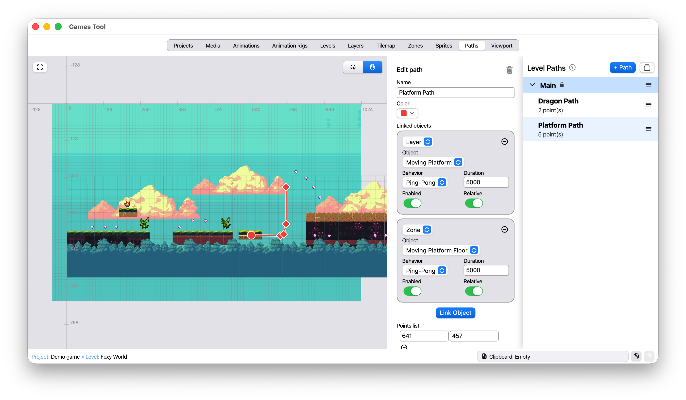

# Games Tool

`games_tool` is a Flutter application for learning the fundamentals of 2D game development through practical level authoring.

Instead of starting from engine code, you design the game world visually and export structured data that can be executed by runtime projects. It is meant for students and developers who want to understand how level data, gameplay rules, and rendering connect.

## What You Can Define With `games_tool`

`games_tool` lets you create complete 2D levels by editing:

- project and level organization
- media assets and groups
- tilemap layers (tile size, map data, depth, visibility, offsets)
- sprites (position, size, type, animation link, depth, flips)
- zones (collision, triggers, gameplay metadata, grouping)
- paths and path bindings (move layers, zones, or sprites over time)
- animation clips, frame rigs, anchors, and hit boxes
- viewport and camera setup (size, position, adaptation mode)
- level-wide settings (background color, depth sensitivity, extra gameplay data)

This gives you a clean data-driven workflow: author once, run in multiple runtimes.

## Levels Section (Example)



## Repository Structure

- `games_tool/`
  - Flutter editor/authoring app (where levels and assets are configured).
- `game_example_libgdx/`
  - Java + LibGDX runtime that loads the exported JSON data and runs the game.
- `game_example_flutter/`
  - Flutter runtime port that loads the same exported data model.
- `games_tool_tutorial/`
  - Tutorial/support assets used for documentation and learning materials.

## Why Two Runtime Examples?

The two examples show that the same authored data can drive different engines/frameworks:

- `game_example_libgdx`: reference implementation in a traditional game-engine stack.
- `game_example_flutter`: equivalent runtime in Flutter, useful for mobile/web/desktop Flutter workflows.

This helps you compare architecture and behavior across platforms while keeping the level content source unified.

## Recommended Workflow

1. Build/edit levels in `games_tool`.
2. Export/update JSON and assets.
3. Run `game_example_libgdx` to validate engine-style runtime behavior.
4. Run `game_example_flutter` to validate Flutter runtime parity.

## Quick Start

### `games_tool`

```bash
cd games_tool
flutter pub get
flutter run -d macos
```

### `game_example_flutter`

```bash
cd game_example_flutter
flutter pub get
flutter run -d macos
```

### `game_example_libgdx`

```bash
cd game_example_libgdx
./run.sh
```

## Projects Storage (`games_tool`)

Projects are stored in OS app-data under `GamesTool`:

- macOS: `~/Library/Application Support/GamesTool/projects`
- Linux: `~/.local/share/GamesTool/projects` (or `$XDG_DATA_HOME/GamesTool/projects`)
- Windows: `%APPDATA%\\GamesTool\\projects`

Index file:

- `.../GamesTool/projects_index.json`
